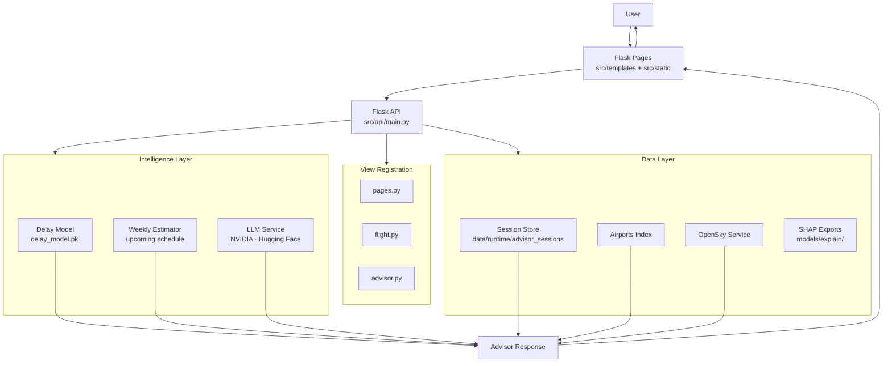
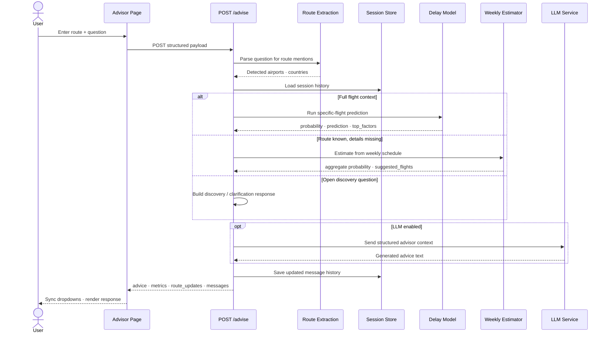
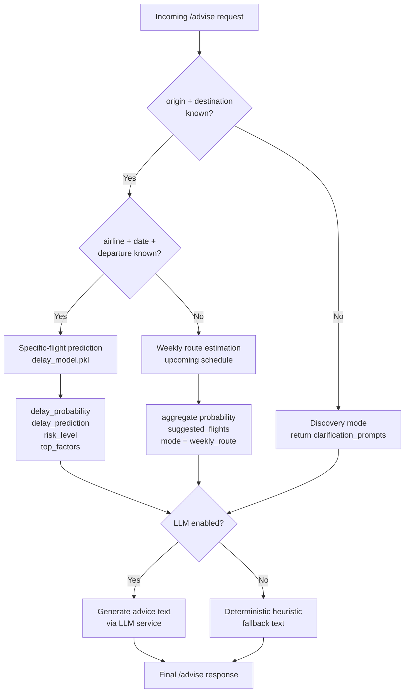
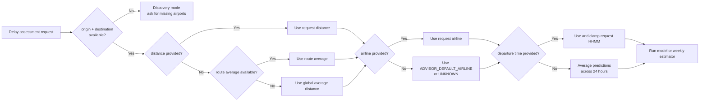
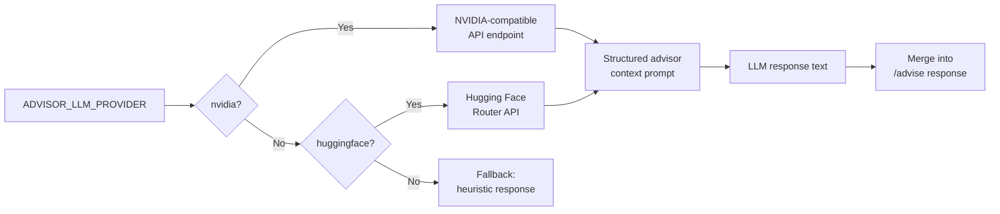
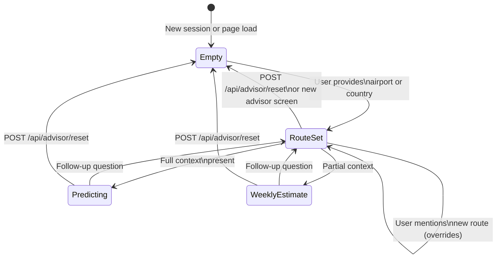
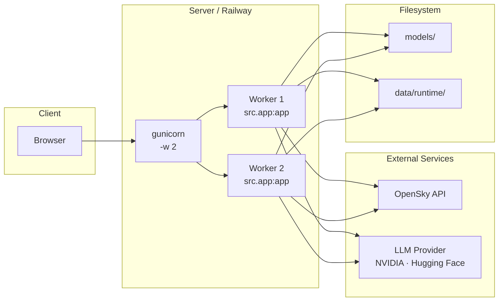

# Flight Advisor — Architecture

> This document describes the current runtime architecture. For the live API docs see [Flight Advisor API Docs](https://flightadvisor.up.railway.app/docs/). For deployment and configuration see [`PROTOTYPE.md`](./PROTOTYPE.md).

---

## 1. System Overview

Flight Advisor is structured in four horizontal layers:

```
┌─────────────────────────────────────────────────────┐
│                  Delivery Layer                     │
│   Flask pages · Jinja2 templates · Static assets   │
├─────────────────────────────────────────────────────┤
│                    API Layer                        │
│   View registration · Request schemas · Routing    │
├─────────────────────────────────────────────────────┤
│                 Intelligence Layer                  │
│   Delay model · Weekly estimator · LLM service     │
├─────────────────────────────────────────────────────┤
│                    Data Layer                       │
│   Model artifacts · Airports index · Session store │
│   OpenSky · Weekly schedule · SHAP exports         │
└─────────────────────────────────────────────────────┘
```

---

## 2. Component Map



---

## 3. Advisor Request Lifecycle



---

## 4. Prediction Decision Tree



---

## 5. Missing-Feature Fallback Chain

When the advisor has enough route context to estimate delay, it resolves missing predictive inputs instead of failing hard:



Current implementation details:

- `distance`: request -> route average -> global average
- `airline`: request -> `ADVISOR_DEFAULT_AIRLINE` -> `UNKNOWN`
- `scheduled_departure`: request -> clamped HHMM, otherwise 24-hour average
- `origin_airport` and `destination_airport` are still mandatory for delay assessment
- `country` is inferred from the airport index for UI route updates when possible, but it is not part of the same predictor fallback chain

---

## 6. LLM Provider Selection



**Token budget rules:**

| Scenario | Budget source |
|---|---|
| Compact mode (`ADVISOR_LLM_COMPACT_MODE=1`) | Reduced ceiling, shorter history |
| Qwen-like model detected | `QWEN_MAX_TOKENS` ceiling |
| Travel guide request | `ADVISOR_LLM_GUIDE_MAX_TOKENS` |
| Default | Standard advisor budget |

---

## 7. Session & Route State



---

## 8. Repository → Runtime Mapping

```
src/
├── app.py                        ← Deployment entrypoint
└── api/
    ├── main.py                   ← Flask factory, schemas, predictor, bootstrap
    ├── views/
    │   ├── pages.py              ← GET / /front /flight /predictions /advisor
    │   ├── flight.py             ← GET /api/flight/countries /airports /departures
    │   └── advisor.py            ← POST /advise  GET /history  POST /reset
    └── services/
        ├── llm_service.py        ← NVIDIA / HF transport, prompt assembly
        └── OpenSky.py            ← Live flight integration

models/
├── delay_model.pkl               ← Serialized ML model
├── delay_model_meta.json         ← Feature names, thresholds
└── explain/                      ← SHAP exports for top_factors

data/
└── runtime/
    └── advisor_sessions/         ← Per-session chat history (JSON files)

src/jobs/
├── generate_future_flights.py    ← Future schedule generation
├── weekly_pipeline.py            ← Weekly processing orchestration
├── weekly_predict.py             ← Weekly prediction output
└── csv_to_parquet_converter.py   ← Data format helper

dashboard/
└── app.py                        ← Optional Dash analytics (ENABLE_DASH=1)
```

---

## 9. Deployment Topology



> ⚠️ Both workers share the same filesystem. Session files and model artifacts are read/written from disk — ensure your deployment platform provides a persistent volume for `data/runtime/` if session continuity across restarts is required.

---

## 10. Key Design Decisions

| Decision | Rationale |
|---|---|
| Three-tier prediction fallback | Never block the user — always return useful information even with partial input |
| Route context as session state | Keeps dropdowns in sync without requiring the user to re-enter route details |
| Pluggable LLM provider | Allows swapping between NVIDIA and Hugging Face without changing the advisor logic |
| Heuristic fallback when LLM is off | Advisor is functional even without LLM credentials — useful for local development |
| Weekly schedule from generated data | Decouples route estimation from live booking APIs that are not yet integrated |
