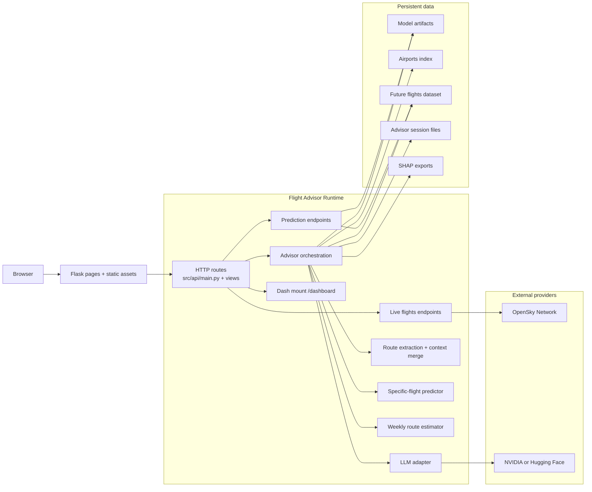
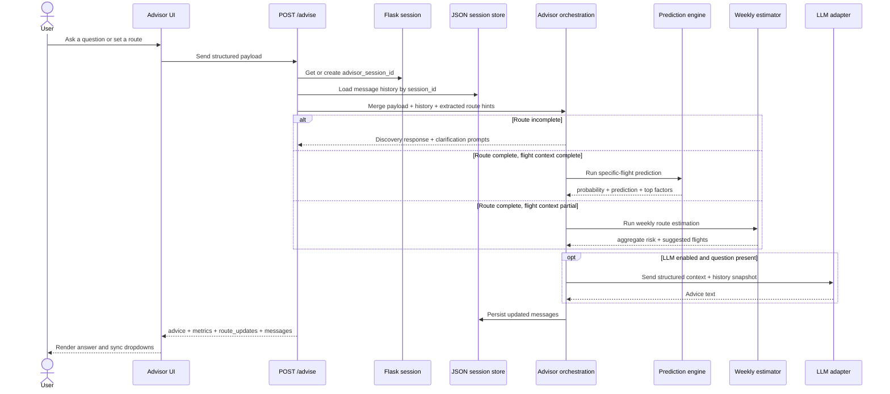
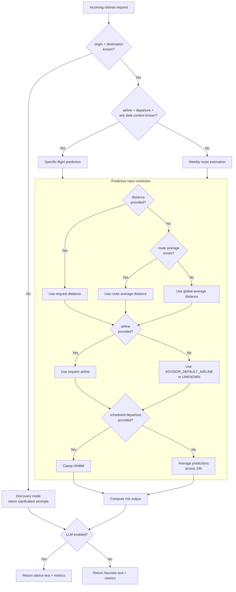
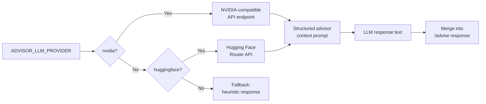
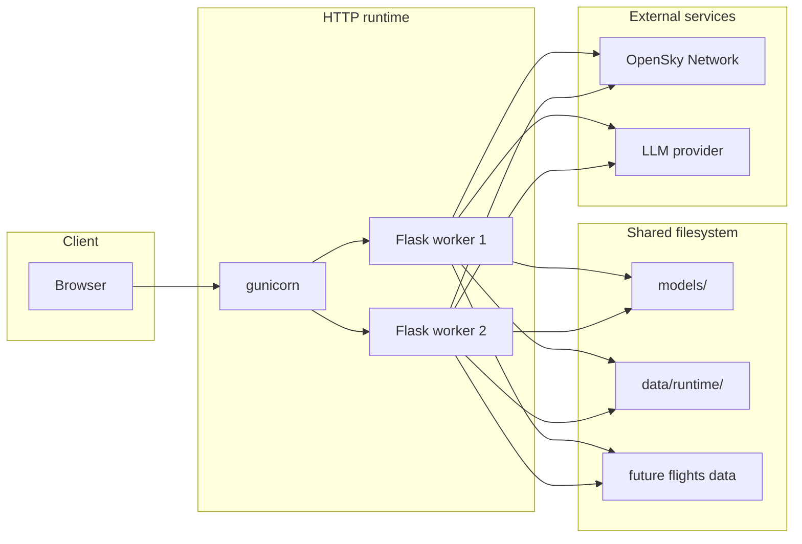

# Flight Advisor — Architecture

> This document describes the current runtime architecture. For the live API docs see [Flight Advisor API Docs](https://flightadvisor.up.railway.app/docs/). For deployment and configuration see [`PROTOTYPE.md`](./PROTOTYPE.md).

---

## 1. System Overview

Flight Advisor is structured in four horizontal layers:

```
┌─────────────────────────────────────────────────────┐
│                  Delivery Layer                     │
│   Flask pages · Jinja2 templates · Static assets    │
├─────────────────────────────────────────────────────┤
│                    API Layer                        │
│   View registration · Request schemas · Routing     │
├─────────────────────────────────────────────────────┤
│                 Intelligence Layer                  │
│   Delay model · Weekly estimator · LLM service      │
├─────────────────────────────────────────────────────┤
│                    Data Layer                       │
│   Model artifacts · Airports index · Session store  │
│   OpenSky · Weekly schedule · SHAP exports          │
└─────────────────────────────────────────────────────┘
```

---

## 2. Runtime Boundaries

Shows system boundaries and how internal components connect to persistent data and external providers.



---

## 3. Advisor Orchestration

Shows session identity, message persistence, and the three prediction branches in their real execution order.



**Session notes:**

- Session identity (`advisor_session_id`) lives in the Flask session cookie — it is browser-scoped and not persisted to disk.
- Message history is persisted separately in `data/runtime/advisor_sessions/` keyed by session ID.
- `POST /api/advisor/reset` clears both the in-memory route context and the persisted message file.
- Navigating to a new advisor screen resets route context but does not clear message history unless reset is explicitly called.

---

## 4. Delay Assessment & Input Resolution

Combines prediction mode selection and feature fallback into one flow. Fallback only applies once the system has confirmed it has enough route context to attempt a prediction.



**Resolution rules:**

| Feature | Resolution order |
|---|---|
| `distance` | Request → route historical average → global average |
| `airline` | Request → `ADVISOR_DEFAULT_AIRLINE` → `UNKNOWN` |
| `scheduled_departure` | Request (clamped HHMM) → average across 24-hour window |
| `origin_airport` / `destination_airport` | **Required** — no fallback; triggers discovery mode if absent |
| `origin_country` / `destination_country` | Inferred from airport index for UI `route_updates`; not part of the predictor fallback chain |

---

## 5. LLM Provider Selection



**Token budget rules:**

| Scenario | Budget source |
|---|---|
| Compact mode (`ADVISOR_LLM_COMPACT_MODE=1`) | Reduced ceiling, shorter history |
| Qwen-like model detected | `QWEN_MAX_TOKENS` ceiling |
| Travel guide request | `ADVISOR_LLM_GUIDE_MAX_TOKENS` |
| Default | Standard advisor budget |

---

## 6. Deployment Topology



> ⚠️ Both workers share the same filesystem. Session files and model artifacts are read/written from disk — ensure your deployment platform provides a persistent volume for `data/runtime/` if session continuity across restarts is required.

```bash
# Production
gunicorn -w 2 -b 0.0.0.0:$PORT src.app:app

# Plain Python on Railway
python src/app.py   # reads PORT automatically
```

---

## 7. Repository → Runtime Mapping

```
src/
├── app.py                        ← Deployment entrypoint
└── api/
    ├── main.py                   ← Flask factory, schemas, predictor, bootstrap
    ├── views/
    │   ├── pages.py              ← GET / /front /flight /predictions /advisor
    │   ├── flight.py             ← GET /api/flight/countries /airports /departures
    │   └── advisor.py            ← POST /advise  GET /history  POST /reset
    └── services/
        ├── llm_service.py        ← NVIDIA / HF transport, prompt assembly
        └── OpenSky.py            ← Live flight integration

models/
├── delay_model.pkl               ← Serialized ML model
├── delay_model_meta.json         ← Feature names, thresholds
└── explain/                      ← SHAP exports for top_factors

data/
└── runtime/
    └── advisor_sessions/         ← Per-session chat history (JSON files)

src/jobs/
├── generate_future_flights.py    ← Future schedule generation
├── weekly_pipeline.py            ← Weekly processing orchestration
├── weekly_predict.py             ← Weekly prediction output
└── csv_to_parquet_converter.py   ← Data format helper

dashboard/
└── app.py                        ← Optional Dash analytics (ENABLE_DASH=1)
```

---

## 8. Key Design Decisions

| Decision | Rationale |
|---|---|
| Three-tier prediction fallback | Never block the user — always return useful information even with partial input |
| Route context as session state | Keeps dropdowns in sync without requiring the user to re-enter route details |
| Pluggable LLM provider | Allows swapping between NVIDIA and Hugging Face without changing the advisor logic |
| Heuristic fallback when LLM is off | Advisor is functional even without LLM credentials — useful for local development |
| Weekly schedule from generated data | Decouples route estimation from live booking APIs that are not yet integrated |
| OpenSky as external provider | Live flight data quality and availability are outside the application's control |
