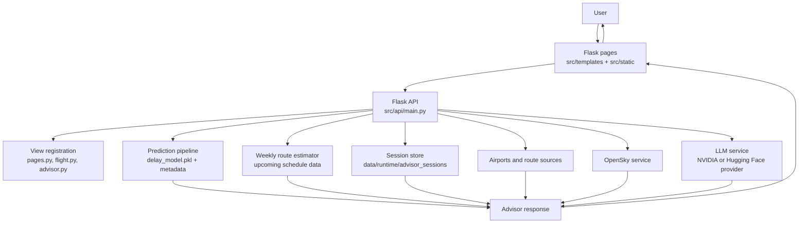
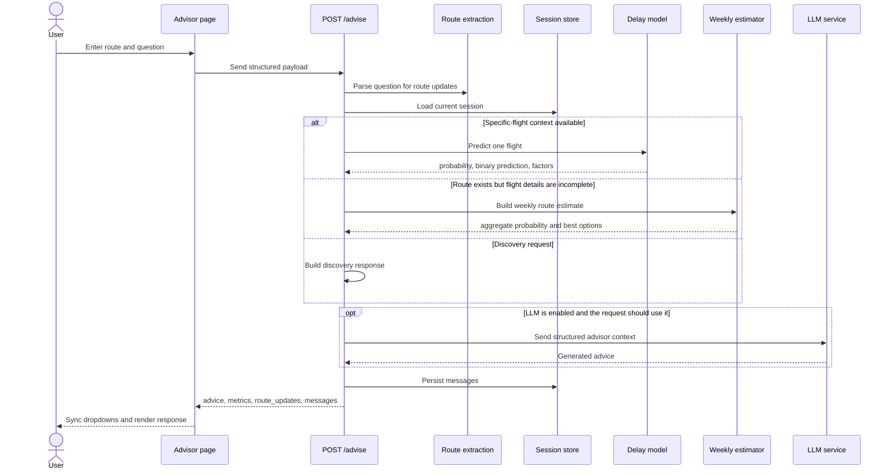

# Flight Advisor - Current Prototype

This document describes the current runtime prototype implemented in the repository. It replaces earlier design notes and focuses only on the active code path.

## 1. Scope

The current prototype covers:

- Flask pages and JSON APIs served by `src/api/main.py`
- delay prediction for a specific flight
- weekly route estimation when the user provides only partial route context
- airport and route APIs used by the dropdown-based frontend
- session-aware advisor conversations with history and reset
- configurable LLM generation for travel guidance and advisor answers
- live-flight lookup through OpenSky

## 2. Current architecture

### Main runtime components

- `src/api/main.py`: schemas, feature preparation, model loading, weekly fallback logic, endpoint registration, and Flask bootstrap.
- `src/api/views/advisor.py`: `/advise`, advisor history, and advisor reset flow.
- `src/api/views/flight.py`: country, airport, and departure endpoints used by dropdowns.
- `src/api/views/pages.py`: page routes for the Flask frontend.
- `src/api/services/llm_service.py`: configurable LLM transport and prompt rules.
- `src/api/services/OpenSky.py`: live-flight integration.
- `dashboard/app.py`: optional Dash app, mounted under `/dashboard` when enabled.

## 3. User-facing pages

| Route | Purpose | Main interactions |
|---|---|---|
| `/` or `/front` | Landing and dashboard page | Overview visuals and navigation |
| `/flight` or `/flights` | Flight exploration | Country and airport dropdowns, departure lookup |
| `/predictions` | Prediction page | Structured delay prediction workflow |
| `/advisor` | Conversational advisor | Route context, delay advice, travel guidance, session history |
| `/dashboard` | Optional Dash mount | Supplemental analytics when Dash is enabled |

## 4. Advisor runtime flow

## 5. Prediction strategy

### 5.1 Specific-flight prediction

The specific-flight path is used when the request has enough structured context to build the model features directly. Typical inputs are:

- `origin_airport`
- `destination_airport`
- `airline`
- `scheduled_departure`
- calendar fields such as `flight_date` or `year`, `month`, `day`, `day_of_week`
- optional `distance`

Outputs include:

- `delay_probability`
- `delay_prediction`
- `risk_level`
- `top_factors`

### 5.2 Weekly route fallback

If the route is known but airline, departure time, or exact date are missing, the advisor no longer blocks the user. Instead, it can estimate the route through the generated weekly schedule.

Current behavior:

- origin and destination are enough to trigger route-level estimation when the question asks for delay-related guidance
- the weekly window is controlled by `ADVISOR_WEEKLY_WINDOW_DAYS`
- the response mode becomes `weekly_route`
- the response can include lower-risk suggested flights from the weekly slice

### 5.3 Missing-feature fallback

When some flight-level fields are unavailable, the predictor can still work from other signals:

- if `distance` is present in the request, use it directly
- otherwise use the historical average distance for the route
- if the route average is unavailable, use the global average distance
- if airline or country-level detail is missing, rely on the remaining route, calendar, and distance features instead of refusing the prediction

This fallback path is the reason the advisor can keep producing a prediction even when the user message is incomplete.

## 6. Request and response contract

### 6.1 `/advise` request

| Field | Type | Notes |
|---|---|---|
| `origin_country` | string or null | Optional country selected or inferred |
| `origin_airport` | string or null | Origin IATA code |
| `destination_country` | string or null | Optional destination country |
| `destination_airport` | string or null | Destination IATA code |
| `airline` | string or null | Airline IATA code |
| `scheduled_departure` | integer or null | HHMM |
| `flight_date` | string or null | `YYYY-MM-DD` |
| `year`, `month`, `day`, `day_of_week` | integer or null | Alternate date inputs |
| `distance` | number or null | Miles |
| `question` | string or null | Free-form advisor request |

### 6.2 `/advise` response

| Field | Type | Notes |
|---|---|---|
| `advice` | string | Final advisor text |
| `delay_probability` | number or null | Delay probability when prediction is available |
| `delay_prediction` | integer or null | Binary output, typically `0` or `1` |
| `risk_level` | string or null | Risk label |
| `top_factors` | list | Human-readable explanation factors |
| `suggested_flights` | list | Weekly or route alternatives |
| `clarification_prompts` | list | Follow-up prompts when discovery needs more detail |
| `mode` | string | Examples: `route`, `weekly_route`, `discovery` |
| `advice_source` | string | Heuristic, weekly model, or LLM-backed advice path |
| `advice_model` | string or null | LLM model identifier when available |
| `session_id` | string or null | Advisor session key |
| `messages` | list | Serialized chat history |
| `route_updates` | object or null | Sync payload for route dropdowns |

## 7. Route-context rules

The advisor now treats route context as first-class state instead of a side effect.

Current rules:

- route mentions in the free-form question are parsed from countries, cities, airport names, and IATA codes
- if an airport is detected, the backend attempts to auto-select the corresponding country
- if the user explicitly mentions a new route, that explicit route overrides the previous route context
- `route_updates` is returned so the frontend can update both country and airport dropdowns after the response
- the advisor page resets route context when a new advisor screen is opened
- chat history can be cleared through `POST /api/advisor/reset`

These rules keep the dropdown state aligned with the conversation instead of forcing the user to re-enter the route manually.

## 8. LLM orchestration

The current advisor is not tied to a single hosted model.

### Provider model

- provider is selected by `ADVISOR_LLM_PROVIDER` or `LLM_PROVIDER`
- supported provider labels are `nvidia` and `huggingface`
- model selection is driven by `ADVISOR_LLM_MODEL` or `LLM_MODEL`

### Runtime behavior

- compact mode can be enabled for lighter requests
- Qwen-like models use smaller history and token budgets automatically
- complete travel-guide requests use a larger token budget and more history
- if the LLM is disabled or errors, the advisor still returns deterministic fallback advice
- prompts operate on structured runtime context and should not invent flights, prices, or purchase confirmations

## 9. Data sources and generated assets

### Persistent artifacts

- `models/delay_model.pkl`
- `models/delay_model_meta.json`
- `models/explain/`

### Runtime and reference data

- airports index used by `/api/flight/countries` and `/api/flight/airports`
- upcoming schedule data used by weekly route prediction
- advisor session files under `data/runtime/advisor_sessions`
- OpenSky live-flight payloads for `/api/live_flights`

### Jobs

- `src/jobs/generate_future_flights.py`
- `src/jobs/weekly_pipeline.py`
- `src/jobs/weekly_predict.py`
- `src/jobs/csv_to_parquet_converter.py`

## 10. Current constraints

- booking and payment are not implemented in this backend
- real-time fare shopping is still optional or absent, depending on external integration
- live-flight data quality depends on OpenSky availability
- the Flask pages and the Dash app still overlap in some analytics responsibilities
- route extraction is heuristic and should be treated as a practical parser, not a full NLU system
