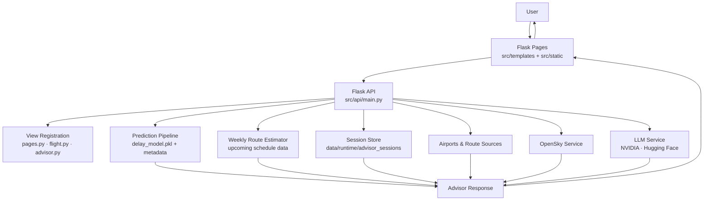
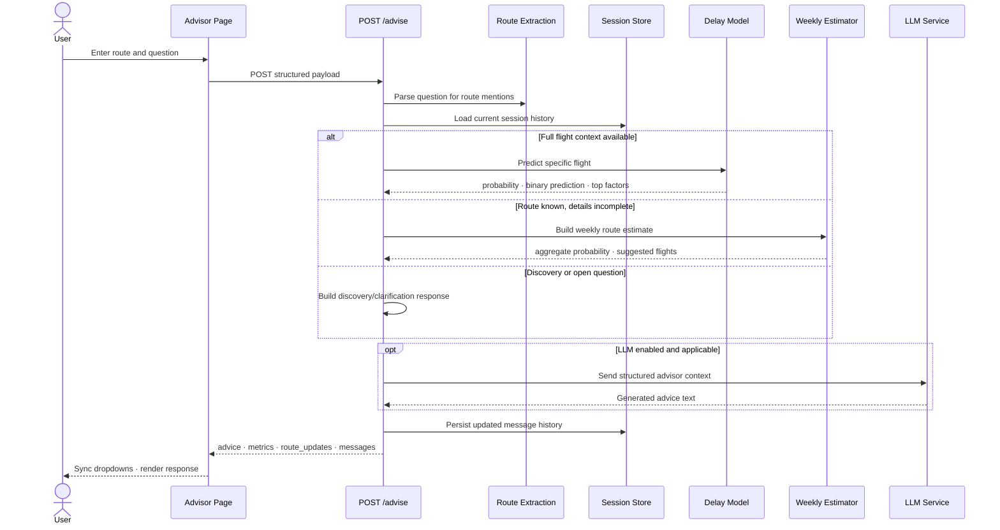

# Flight Advisor — Technical Prototype Reference

> **Status:** Active prototype — this document describes the current runtime implementation only. Earlier design notes have been superseded.

---

## 1. Scope

This document covers everything that is live and running in the repository today:

- Flask deployment entrypoint and API composition
- ML-based delay prediction for specific flights
- Weekly route estimation for partial route context
- Session-aware conversational advisor with history and reset
- Airport and route APIs powering the frontend dropdowns
- Configurable LLM generation for travel guidance
- Live flight lookup via OpenSky

---

## 2. Runtime Architecture

### Component map



### Key source files

| File | Role |
|---|---|
| `src/app.py` | Deployment entrypoint — Railway, plain Python, or gunicorn |
| `src/api/main.py` | Schemas, feature prep, model loading, weekly fallback, endpoint registration |
| `src/api/views/advisor.py` | `/advise`, session history, and session reset |
| `src/api/views/flight.py` | Country, airport, and departure endpoints for dropdowns |
| `src/api/views/pages.py` | Page routes for the Jinja2 frontend |
| `src/api/services/llm_service.py` | Configurable LLM transport, provider selection, prompt rules |
| `src/api/services/OpenSky.py` | Live flight integration |
| `dashboard/app.py` | Optional Dash app, mounted at `/dashboard` when `ENABLE_DASH=1` |

---

## 3. User-Facing Pages

| Route | Purpose | Main interactions |
|---|---|---|
| `/` or `/front` | Landing and dashboard | Overview visuals and navigation |
| `/flight` or `/flights` | Flight exploration | Country/airport dropdowns, departure lookup |
| `/predictions` | Prediction workflow | Structured delay prediction form |
| `/advisor` | Conversational advisor | Route context, delay advice, travel guidance, session history |
| `/dashboard` | Optional Dash mount | Supplemental analytics when `ENABLE_DASH=1` |

---

## 4. Advisor Runtime Flow



---

## 5. Prediction Strategy

### 5.1 Specific-flight prediction

Used when the request contains enough structured context to build model features directly.

**Minimum useful inputs:**
- `origin_airport` + `destination_airport`
- `airline`
- `scheduled_departure` (HHMM)
- Date context — `flight_date` or `year`/`month`/`day`/`day_of_week`

**Outputs:**
- `delay_probability` — model probability score
- `delay_prediction` — binary label (`0` = on time, `1` = delayed)
- `risk_level` — human-readable label (`LOW`, `MEDIUM`, `HIGH`)
- `top_factors` — SHAP-backed explanation factors

### 5.2 Weekly route fallback

Triggered when origin and destination are known but airline, departure time, or exact date are missing. The advisor does not block the user — it estimates delay risk from the generated weekly schedule.

**Behavior:**
- `ADVISOR_WEEKLY_WINDOW_DAYS` controls the prediction window (clamped 1–14)
- Response `mode` is set to `weekly_route`
- Response can include lower-risk suggested flights from the weekly slice

### 5.3 Missing-feature resolution

The predictor applies a deterministic fallback chain for missing fields instead of refusing the request:

```
distance provided?  →  use it directly
    ↓ no
route historical average available?  →  use it
    ↓ no
use global average distance
```

The same logic applies to missing airline or country-level detail — the model runs on remaining route, calendar, and distance features rather than failing.

---

## 6. Request & Response Contract

### 6.1 `POST /advise` — Request

| Field | Type | Notes |
|---|---|---|
| `origin_country` | `string \| null` | Optional — auto-inferred from airport when possible |
| `origin_airport` | `string \| null` | IATA code |
| `destination_country` | `string \| null` | Optional — auto-inferred from airport |
| `destination_airport` | `string \| null` | IATA code |
| `airline` | `string \| null` | IATA airline code |
| `scheduled_departure` | `integer \| null` | HHMM format |
| `flight_date` | `string \| null` | `YYYY-MM-DD` |
| `year`, `month`, `day`, `day_of_week` | `integer \| null` | Alternative to `flight_date` |
| `distance` | `number \| null` | Miles |
| `question` | `string \| null` | Free-form advisor question |

### 6.2 `POST /advise` — Response

| Field | Type | Notes |
|---|---|---|
| `advice` | `string` | Final advisor text |
| `delay_probability` | `number \| null` | Delay probability (0–1) |
| `delay_prediction` | `integer \| null` | `0` = on time, `1` = delayed |
| `risk_level` | `string \| null` | `LOW` / `MEDIUM` / `HIGH` |
| `top_factors` | `list` | Human-readable explanation factors |
| `suggested_flights` | `list` | Weekly or route alternatives |
| `clarification_prompts` | `list` | Follow-up prompts for discovery mode |
| `mode` | `string` | `route` / `weekly_route` / `discovery` |
| `advice_source` | `string` | `heuristic` / `weekly_model` / `llm` |
| `advice_model` | `string \| null` | LLM model identifier, if used |
| `session_id` | `string \| null` | Session key |
| `messages` | `list` | Serialized chat history |
| `route_updates` | `object \| null` | Dropdown sync payload for the frontend |

### 6.3 Example

```bash
curl -X POST http://localhost:8000/advise \
  -H "Content-Type: application/json" \
  -d '{
    "origin_airport": "GRU",
    "destination_airport": "JFK",
    "question": "Use the weekly schedule and tell me if this route is likely to be delayed."
  }'
```

```json
{
  "delay_probability": 0.38,
  "delay_prediction": 0,
  "risk_level": "LOW",
  "mode": "weekly_route",
  "advice_source": "weekly_model",
  "advice": "On-time predicted. Estimate uses the weekly schedule — no exact date was provided.",
  "top_factors": [
    { "feature": "distance", "impact": "Estimated from historical route average." }
  ],
  "route_updates": {
    "origin":      { "country": "Brazil",        "airport": "GRU" },
    "destination": { "country": "United States", "airport": "JFK" }
  }
}
```

---

## 7. Route-Context Rules

Route context is treated as first-class session state, not a side effect.

| Rule | Behavior |
|---|---|
| **NLP parsing** | Country names, city names, airport names, and IATA codes are all parsed from the free-form question |
| **Country inference** | If an airport code is detected, the backend attempts to fill its country automatically |
| **Override** | An explicit new route in the message replaces the previous session route context |
| **Frontend sync** | `route_updates` is always returned so both country and airport dropdowns stay aligned |
| **Session reset** | `POST /api/advisor/reset` clears chat history and route context |
| **Page reset** | Navigating to a new advisor screen resets route context automatically |

---

## 8. LLM Orchestration

### Provider configuration

| Variable | Purpose |
|---|---|
| `ADVISOR_LLM_PROVIDER` or `LLM_PROVIDER` | Provider label: `nvidia` or `huggingface` |
| `ADVISOR_LLM_MODEL` or `LLM_MODEL` | Model identifier |
| `NVIDIA_API_KEY` | Key for NVIDIA-compatible calls |
| `HF_TOKEN` or `HUGGINGFACE_API_KEY` | Key for Hugging Face router calls |

### Runtime behavior

| Scenario | Behavior |
|---|---|
| LLM enabled, request warrants it | LLM receives structured runtime context and generates advice |
| Compact mode (`ADVISOR_LLM_COMPACT_MODE=1`) | Smaller token budget and shorter history |
| Qwen-like models | Automatically use reduced history and `QWEN_MAX_TOKENS` ceiling |
| Travel guide requests | Use larger budget from `ADVISOR_LLM_GUIDE_MAX_TOKENS` |
| LLM disabled or errors | Deterministic heuristic fallback — advisor still returns an answer |

**Prompt constraints:** The LLM is instructed not to invent flights, prices, or purchase confirmations. All advice is grounded in the structured context passed from the prediction pipeline.

---

## 9. Data Sources & Artifacts

### Model artifacts

| Path | Description |
|---|---|
| `models/delay_model.pkl` | Serialized trained delay model |
| `models/delay_model_meta.json` | Feature names, thresholds, pipeline metadata |
| `models/explain/` | SHAP exports for explainability |

### Runtime data

| Source | Used by |
|---|---|
| Airports index (`AIRPORTS_INDEX_SOURCE`) | `/api/flight/countries`, `/api/flight/airports` |
| Weekly schedule data | Weekly route estimator |
| `data/runtime/advisor_sessions/` | Session store for advisor chat history |
| OpenSky API | `/api/live_flights`, `/api/live_flights/<icao24>` |

### Jobs

| Script | Purpose |
|---|---|
| `src/jobs/generate_future_flights.py` | Future schedule generation |
| `src/jobs/weekly_pipeline.py` | Weekly processing pipeline |
| `src/jobs/weekly_predict.py` | Weekly prediction output generation |
| `src/jobs/csv_to_parquet_converter.py` | Data format conversion helper |

---

## 10. Full API Surface

| Method | Path | Description |
|---|---|---|
| `GET` | `/health` | Liveness check |
| `GET` | `/docs` | Swagger UI |
| `GET` | `/redoc` | ReDoc |
| `GET` | `/openapi.json` | OpenAPI schema |
| `POST` | `/predict` | Structured single-flight delay prediction |
| `POST` | `/advise` | Full advisor workflow |
| `GET` | `/api/advisor/history` | Current session chat history |
| `POST` | `/api/advisor/reset` | Clear session history and route context |
| `GET` | `/api/flight/countries` | Countries from airports index |
| `GET` | `/api/flight/airports?country=` | Airports for a selected country |
| `GET` | `/api/flight/departures?airport=` | Upcoming departures or schedule placeholders |
| `GET` | `/api/upcoming_flights` | Upcoming schedule view |
| `GET` | `/api/weekly_predictions` | Weekly prediction listing |
| `GET` | `/api/live_flights` | Live flights from OpenSky |
| `GET` | `/api/live_flights/<icao24>` | Live details for one aircraft |
| `GET` | `/api/routes` | Route and endpoint discovery payload |

---

## 11. Current Constraints

| Area | Status |
|---|---|
| **Booking & payment** | Not implemented — no real-time purchase flow |
| **Fare shopping** | Optional or absent — depends on external integration |
| **Live flight quality** | Tied to OpenSky availability and update cadence |
| **Route extraction** | Heuristic NLP parser — not a full NLU system; may miss edge cases |
| **Dashboard overlap** | Dash app and Flask pages share some analytics responsibilities; consolidation planned |
| **RAG module** | `src/rag/` is not active in the current advisor flow — to be formalized or removed |

---

## 12. Deployment

```bash
# Development
python src/app.py

# Production (Railway or any server)
gunicorn -w 2 -b 0.0.0.0:$PORT src.app:app

# Plain Python on Railway
python src/app.py   # reads PORT automatically
```
