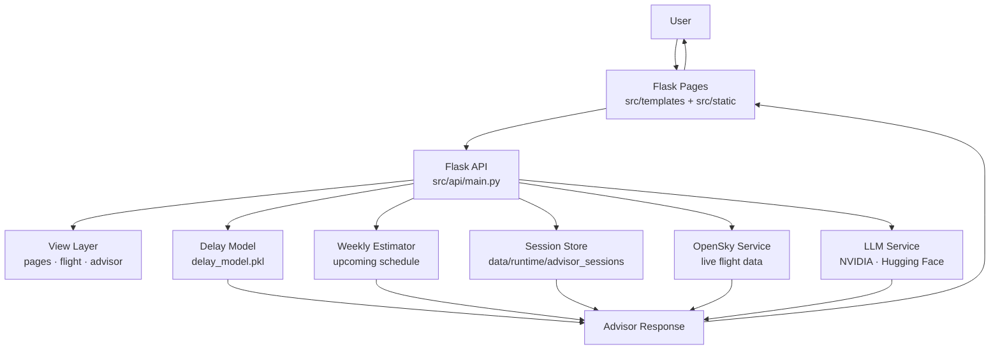

# ✈️ Flight Advisor

> **AI-powered flight delay prediction and conversational travel assistant**


A full-stack Flask application that combines machine learning delay models, natural language understanding, live flight data, and a configurable LLM backend into a session-aware travel advisor.

---

## 🚀 Live Features

| Capability | Description |
|---|---|
| 🔮 **Delay Prediction** | Predict delay probability and risk level for a specific flight using a trained ML model |
| 📅 **Weekly Route Estimation** | Estimate delay risk by route when exact flight details are unavailable |
| 💬 **Conversational Advisor** | Session-aware chat that extracts route context from natural language |
| 🌐 **Live Flights** | Real-time aircraft tracking via OpenSky |
| 🤖 **LLM Integration** | Pluggable Hugging Face backend for travel guidance |
| 🗺️ **Route Sync** | Automatic frontend dropdown sync when the user mentions a new route |

---

## 🏗️ Architecture



---

## 🗂️ Project Structure

```text
FIAP-3/
├── dashboard/              # Optional Dash analytics app
├── data/                   # Raw, processed, and runtime data
├── docs/                   # Architecture diagrams and SVG assets
├── models/                 # Trained model artifacts and SHAP exports
├── notebooks/              # Exploration and experimentation
├── src/
│   ├── app.py              # Deployment entrypoint (Railway / gunicorn)
│   ├── api/
│   │   ├── main.py         # Flask composition, schemas, predictor, API registration
│   │   ├── services/       # LLM, flight, and OpenSky integrations
│   │   └── views/          # pages.py · flight.py · advisor.py
│   ├── jobs/               # Schedule generation and weekly prediction jobs
│   ├── static/             # JavaScript and CSS
│   └── templates/          # Jinja2 HTML templates
└── requirements.txt
```

---

## ⚙️ Getting Started

### Prerequisites

- Python 3.11
- A trained model artifact at `models/delay_model.pkl`
- Optional: LLM API credentials for advisor generation beyond heuristic fallback

### Install

```bash
python -m venv .venv
source .venv/bin/activate        # Windows: .venv\Scripts\activate
pip install -r requirements.txt
```

### Configure `.env`

Create a `.env` file in the project root. Key variables:

```env
# Server
API_PORT=8000
FLASK_DEBUG=1
FLASK_SECRET_KEY=your-secret-key

# LLM Advisor
ADVISOR_LLM_ENABLED=true
ADVISOR_LLM_PROVIDER=nvidia          # nvidia | huggingface
ADVISOR_LLM_MODEL=your-model-id
NVIDIA_API_KEY=your-key
HF_TOKEN=your-hf-token

# Advisor behavior
ADVISOR_WEEKLY_WINDOW_DAYS=7
ADVISOR_LLM_COMPACT_MODE=false
ADVISOR_LLM_GUIDE_MAX_TOKENS=2048

# Optional
ENABLE_DASH=0
```

### Run

```bash
python src/app.py
```

Open:

- `http://localhost:8000/` — Landing page
- `http://localhost:8000/advisor` — Conversational advisor
- `http://localhost:8000/docs` — Swagger UI

---

## 🌐 API Overview

| Method | Path | Description |
|---|---|---|
| `GET` | `/health` | Liveness check |
| `POST` | `/predict` | Structured delay prediction |
| `POST` | `/advise` | Full advisor workflow |
| `GET` | `/api/advisor/history` | Current session chat history |
| `POST` | `/api/advisor/reset` | Clear session and route context |
| `GET` | `/api/flight/countries` | Available countries |
| `GET` | `/api/flight/airports?country=` | Airports for a country |
| `GET` | `/api/live_flights` | Live flights from OpenSky |
| `GET` | `/api/weekly_predictions` | Weekly prediction listing |
| `GET` | `/docs` | Swagger UI |

Full schema available at `/openapi.json`.

---

## 💬 Advisor Example

```bash
curl -X POST http://localhost:8000/advise \
  -H "Content-Type: application/json" \
  -d '{
    "origin_airport": "GRU",
    "destination_airport": "JFK",
    "question": "Is this route likely to be delayed next week?"
  }'
```

```json
{
  "delay_probability": 0.38,
  "delay_prediction": 0,
  "risk_level": "LOW",
  "mode": "weekly_route",
  "advice": "On-time predicted. Estimate uses the weekly schedule as no exact date was specified.",
  "route_updates": {
    "origin": { "country": "Brazil", "airport": "GRU" },
    "destination": { "country": "United States", "airport": "JFK" }
  }
}
```

---

## 🤖 Prediction Strategy

The advisor uses a **three-tier fallback** to always return useful information:

```
1. Specific-flight prediction  →  full model features available
2. Weekly route estimation     →  route known, but date/airline missing
3. Heuristic fallback          →  LLM disabled or unavailable
```

Missing features (like `distance`) are filled from historical route averages, then global averages, so the model never hard-fails on incomplete input.


---

## 🚢 Deployment

**Railway / gunicorn:**

```bash
gunicorn -w 2 -b 0.0.0.0:$PORT src.app:app
```

**Plain Python on Railway:**

```bash
python src/app.py   # reads PORT env var automatically
```

---

## 📋 Related Docs

- [`PROTOTYPE.md`](./PROTOTYPE.md) — Technical current-state reference
- [`docs/`](./docs/) — Architecture diagrams
- `/docs` endpoint — Live Swagger UI

---

## ⚠️ Current Limitations

- Real-time booking and fare purchase are not implemented
- Live flight quality depends on OpenSky availability
- Route extraction uses heuristic NLP, not a full NLU system
- The Dash app and Flask pages overlap in some analytics views (consolidation planned)
