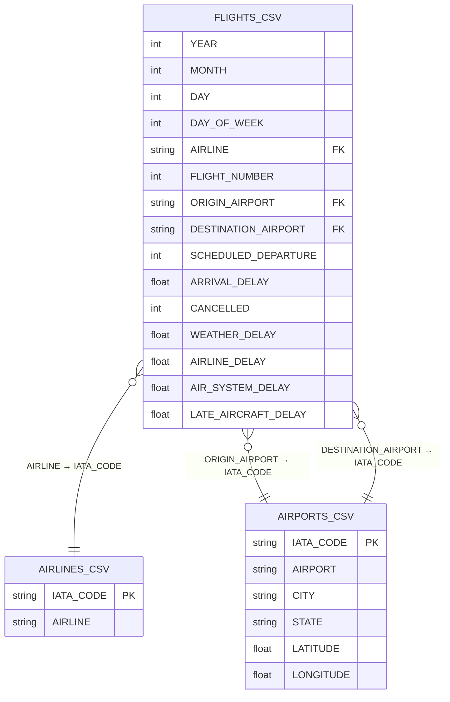
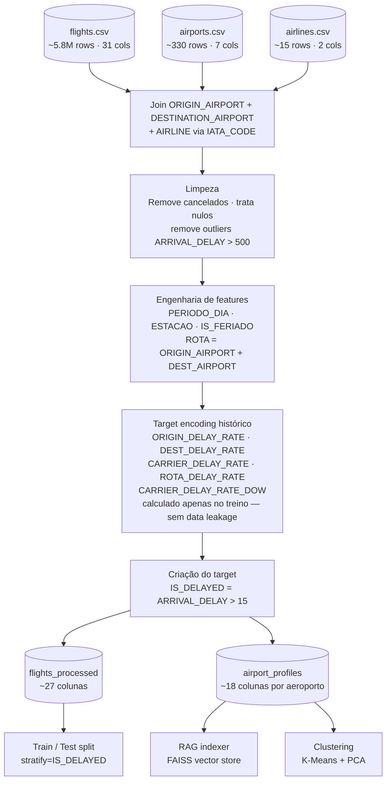
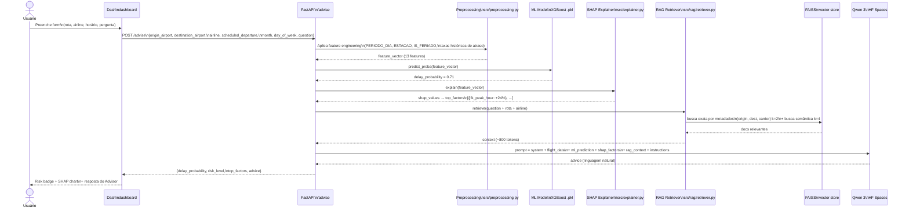

# 🗂️ Flight Advisor — Project Prototyping

> Technical reference document for development. Contains the data structure, feature mapping, dashboard screen flow, and RAG architecture.

---

## Table of Contents

- [0. Diagramas de Arquitetura](#0-diagramas-de-arquitetura)
  - [0.1 Fluxo de dados entre os 3 CSVs](#01-fluxo-de-dados-entre-os-3-csvs)
  - [0.2 Pipeline de processamento](#02-pipeline-de-processamento)
  - [0.3 Arquitetura MVC completa](#03-arquitetura-mvc-completa)
  - [0.4 Fluxo de uma consulta ao Advisor](#04-fluxo-de-uma-consulta-ao-advisor)
- [1. Data Schema](#1-data-schema)
- [2. ML Model Feature Mapping](#2-ml-model-feature-mapping)
- [3. Dashboard Screen Flow](#3-dashboard-screen-flow)
- [4. RAG Document Structure](#4-rag-document-structure)

---

## 0. Diagramas de Arquitetura

### 0.1 Fluxo de dados entre os 3 CSVs



### 0.2 Pipeline de processamento



### 0.3 Arquitetura MVC completa


### 0.4 Fluxo de uma consulta ao Advisor



---

## 1. Data Schema

The project uses **three CSV files** as data sources. `flights.csv` is the main training base; `airports.csv` and `airlines.csv` are reference tables that enrich the data via join.

```
flights.csv  ──── AIRLINE             ────►  airlines.csv (IATA_CODE)
             ──── ORIGIN_AIRPORT      ────►  airports.csv (IATA_CODE)
             ──── DESTINATION_AIRPORT ────►  airports.csv (IATA_CODE)
```

---

### 1.1 Flights Dataset — `flights.csv`

Main training source. Each row represents a domestic flight in the USA.

| # | Column | Type | Example | Description |
|---|---|---|---|---|
| 1 | `YEAR` | int | `2015` | Year of the flight |
| 2 | `MONTH` | int | `11` | Month (1–12) |
| 3 | `DAY` | int | `15` | Day of the month |
| 4 | `DAY_OF_WEEK` | int | `5` | Day of the week (1=Mon … 7=Sun) |
| 5 | `AIRLINE` | str | `DL` | IATA code of the airline — **FK → `airlines.csv`** |
| 6 | `FLIGHT_NUMBER` | int | `1234` | Flight number |
| 7 | `TAIL_NUMBER` | str | `N12345` | Aircraft identification |
| 8 | `ORIGIN_AIRPORT` | str | `JFK` | IATA code origin — **FK → `airports.csv`** |
| 9 | `DESTINATION_AIRPORT` | str | `LAX` | IATA code destination — **FK → `airports.csv`** |
| 10 | `SCHEDULED_DEPARTURE` | int | `1800` | Scheduled departure time (HHMM) |
| 11 | `DEPARTURE_TIME` | float | `1823.0` | Actual departure time (HHMM) |
| 12 | `DEPARTURE_DELAY` | float | `23.0` | Departure delay (min); negative = early |
| 13 | `TAXI_OUT` | float | `15.0` | Taxi time to the runway (min) |
| 14 | `WHEELS_OFF` | float | `1838.0` | Takeoff time (HHMM) |
| 15 | `SCHEDULED_TIME` | float | `360.0` | Scheduled flight time (min) |
| 16 | `ELAPSED_TIME` | float | `371.0` | Actual flight time (min) |
| 17 | `AIR_TIME` | float | `348.0` | Effective time in the air (min) |
| 18 | `DISTANCE` | float | `2475.0` | Route distance (miles) |
| 19 | `WHEELS_ON` | float | `2046.0` | Landing time (HHMM) |
| 20 | `TAXI_IN` | float | `8.0` | Taxi time to the gate (min) |
| 21 | `SCHEDULED_ARRIVAL` | int | `2100` | Scheduled arrival time (HHMM) |
| 22 | `ARRIVAL_TIME` | float | `2134.0` | Actual arrival time (HHMM) |
| 23 | `ARRIVAL_DELAY` | float | `34.0` | Arrival delay (min) — ⚠️ **target variable** |
| 24 | `DIVERTED` | int | `0` | 1 = flight diverted to another airport |
| 25 | `CANCELLED` | int | `0` | 1 = flight cancelled |
| 26 | `CANCELLATION_REASON` | str | `B` | A=Carrier · B=Weather · C=NAS · D=Security |
| 27 | `AIR_SYSTEM_DELAY` | float | `19.0` | Delay by air traffic control (min) |
| 28 | `SECURITY_DELAY` | float | `0.0` | Delay by security (min) |
| 29 | `AIRLINE_DELAY` | float | `15.0` | Delay by airline operational problem (min) |
| 30 | `LATE_AIRCRAFT_DELAY` | float | `0.0` | Delay caused by a delayed aircraft in the previous leg (min) |
| 31 | `WEATHER_DELAY` | float | `0.0` | Delay by weather conditions (min) |

> ⚠️ **Expected nulls:** cause columns (`AIR_SYSTEM_DELAY` … `WEATHER_DELAY`) are null when the flight was not delayed or was cancelled. `CANCELLATION_REASON` is null for non-cancelled flights. `DEPARTURE_TIME`, `ARRIVAL_TIME` and derivatives are null for cancelled flights. Handle before modeling.

---

### 1.2 Airports Dataset — `airports.csv`

Geographic reference table. Join with `flights.csv` via `IATA_CODE = ORIGIN_AIRPORT` or `DESTINATION_AIRPORT`.

| # | Column | Type | Example | Description |
|---|---|---|---|---|
| 1 | `IATA_CODE` | str | `JFK` | IATA code — **PK** |
| 2 | `AIRPORT` | str | `John F Kennedy Intl` | Full name of the airport |
| 3 | `CITY` | str | `New York` | City of the airport |
| 4 | `STATE` | str | `NY` | State (abbreviation) |
| 5 | `COUNTRY` | str | `USA` | Country |
| 6 | `LATITUDE` | float | `40.6398` | Latitude — used in maps and geographic clustering |
| 7 | `LONGITUDE` | float | `-73.7789` | Longitude — used in maps and geographic clustering |

---

### 1.3 Airlines Dataset — `airlines.csv`

Airline reference table. Join with `flights.csv` via `IATA_CODE = AIRLINE`.

| # | Column | Type | Example | Description |
|---|---|---|---|---|
| 1 | `IATA_CODE` | str | `DL` | IATA code — **PK** |
| 2 | `AIRLINE` | str | `Delta Air Lines Inc.` | Full name of the airline |

---

### 1.4 Processed Dataset — `flights_processed`

Result of the cleaning pipeline + joins + feature engineering. Feeds the ML models.

| # | Column | Type | Source | Transformation |
|---|---|---|---|---|
| 1 | `IS_DELAYED` | int | `ARRIVAL_DELAY` | `1` if `ARRIVAL_DELAY > 15`, else `0` — **target** |
| 2 | `ARRIVAL_DELAY_CLEAN` | float | `ARRIVAL_DELAY` | Nulls from cancelled → `NaN`; outliers > 500 min removed |
| 3 | `MONTH` | int | `flights.csv` | Kept |
| 4 | `DAY_OF_WEEK` | int | `flights.csv` | Kept |
| 5 | `SCHEDULED_DEPARTURE` | int | `flights.csv` | Kept |
| 6 | `DISTANCE` | float | `flights.csv` | Kept |
| 7 | `AIRLINE` | str | `flights.csv` | Kept — join key |
| 8 | `ORIGIN_AIRPORT` | str | `flights.csv` | Kept — join key |
| 9 | `DESTINATION_AIRPORT` | str | `flights.csv` | Kept — join key |
| 10 | `AIRLINE_NAME` | str | `airlines.csv` | Full name via `AIRLINE = IATA_CODE` |
| 11 | `ORIGIN_CITY` | str | `airports.csv` | Origin city via `ORIGIN_AIRPORT = IATA_CODE` |
| 12 | `ORIGIN_STATE` | str | `airports.csv` | Origin state |
| 13 | `ORIGIN_LAT` | float | `airports.csv` | Origin latitude (maps) |
| 14 | `ORIGIN_LON` | float | `airports.csv` | Origin longitude (maps) |
| 15 | `DEST_CITY` | str | `airports.csv` | Destination city via `DESTINATION_AIRPORT = IATA_CODE` |
| 16 | `DEST_STATE` | str | `airports.csv` | Destination state |
| 17 | `DEST_LAT` | float | `airports.csv` | Destination latitude (maps) |
| 18 | `DEST_LON` | float | `airports.csv` | Destination longitude (maps) |
| 19 | `PERIODO_DIA` | str | `SCHEDULED_DEPARTURE` | Derived feature — see section 2.2 |
| 20 | `ESTACAO` | str | `MONTH` | Derived feature — see section 2.2 |
| 21 | `ROTA` | str | `ORIGIN_AIRPORT` + `DESTINATION_AIRPORT` | Concatenation: `"JFK_LAX"` |
| 22 | `IS_FERIADO` | int | `YEAR`, `MONTH`, `DAY` | `1` if date is a US federal holiday (lib `holidays`) |
| 23 | `ORIGIN_DELAY_RATE` | float | historical `flights.csv` | Historical delay rate of the origin airport |
| 24 | `DEST_DELAY_RATE` | float | historical `flights.csv` | Historical delay rate of the destination airport |
| 25 | `CARRIER_DELAY_RATE` | float | historical `flights.csv` | Historical delay rate of the airline |
| 26 | `ROTA_DELAY_RATE` | float | historical `flights.csv` | Historical delay rate of the specific route |
| 27 | `CARRIER_DELAY_RATE_DOW` | float | historical `flights.csv` | Airline's delay rate on that day of the week |

---

### 1.5 Airport Profiles — `airport_profiles`

Generated in the EDA by enriching `airports.csv` with statistics from `flights.csv`. Used for clustering and RAG documents.

| # | Column | Type | Source | Description |
|---|---|---|---|---|
| 1 | `IATA_CODE` | str | `airports.csv` | IATA code — PK |
| 2 | `AIRPORT` | str | `airports.csv` | Full name |
| 3 | `CITY` | str | `airports.csv` | City |
| 4 | `STATE` | str | `airports.csv` | State |
| 5 | `LATITUDE` | float | `airports.csv` | Latitude |
| 6 | `LONGITUDE` | float | `airports.csv` | Longitude |
| 7 | `TOTAL_FLIGHTS` | int | `flights.csv` | Total flights in the period |
| 8 | `DELAY_RATE` | float | `flights.csv` | % of flights with `ARRIVAL_DELAY > 15` |
| 9 | `AVG_DELAY` | float | `flights.csv` | Average delay in minutes |
| 10 | `AVG_AIRLINE_DELAY` | float | `flights.csv` | Average `AIRLINE_DELAY` |
| 11 | `AVG_WEATHER_DELAY` | float | `flights.csv` | Average `WEATHER_DELAY` |
| 12 | `AVG_AIR_SYSTEM_DELAY` | float | `flights.csv` | Average `AIR_SYSTEM_DELAY` |
| 13 | `AVG_LATE_AIRCRAFT` | float | `flights.csv` | Average `LATE_AIRCRAFT_DELAY` |
| 14 | `WORST_MONTH` | int | `flights.csv` | Month with the highest delay rate |
| 15 | `BEST_MONTH` | int | `flights.csv` | Month with the lowest delay rate |
| 16 | `WORST_DOW` | int | `flights.csv` | Day of the week with the highest delay rate |
| 17 | `BEST_DOW` | int | `flights.csv` | Day of the week with the lowest delay rate |
| 18 | `CLUSTER` | int | K-Means | Group assigned by the clustering model |

---

## 2. ML Model Feature Mapping

### 2.1 Final Model Features

All features refer to columns in `flights_processed`. Names are aligned with the actual schema of the files.

| # | Feature | Type | Encoding | Expected Importance | Justification |
|---|---|---|---|---|---|
| 1 | `MONTH` | int | Ordinal | High | Strong seasonality: December and July are critical |
| 2 | `DAY_OF_WEEK` | int | Ordinal | High | Fridays and Sundays have a higher delay rate |
| 3 | `SCHEDULED_DEPARTURE` | int | Ordinal | High | Afternoon peak flights accumulate delays from the day |
| 4 | `DISTANCE` | float | Standard | Medium | Long flights have a lower relative delay rate |
| 5 | `PERIODO_DIA` | str | One-Hot | High | Captures the peak effect non-linearly |
| 6 | `ESTACAO` | str | One-Hot | Medium | Winter and summer have distinct behaviors |
| 7 | `IS_FERIADO` | int | Binary | Medium | Holidays increase congestion at hubs |
| 8 | `ORIGIN_DELAY_RATE` | float | Standard | Very High | Airports with a poor history tend to repeat it |
| 9 | `DEST_DELAY_RATE` | float | Standard | High | Congested destinations cause slot waiting |
| 10 | `CARRIER_DELAY_RATE` | float | Standard | Very High | Airlines with a poor history tend to repeat it |
| 11 | `ROTA_DELAY_RATE` | float | Standard | Very High | Specific routes have structural delay patterns |
| 12 | `CARRIER_DELAY_RATE_DOW` | float | Standard | High | Interaction between airline and day of the week |
| 13 | `AIRLINE` | str | One-Hot | High | Operational differences between airlines |

> ⚠️ **Columns excluded from the model (data leakage):** `DEPARTURE_TIME`, `ARRIVAL_TIME`, `WHEELS_OFF`, `WHEELS_ON`, `TAXI_OUT`, `TAXI_IN`, `ELAPSED_TIME`, `AIR_TIME` — are only known after the flight. `DEPARTURE_DELAY` has a very high correlation with the target but is also only available in real-time.

---

### 2.2 Feature Engineering Rules

| Derived Feature | Logic | Possible Values |
|---|---|---|
| `PERIODO_DIA` | `SCHEDULED_DEPARTURE < 600` → early_morning | `early_morning`, `morning`, `afternoon`, `night` |
| | `600 ≤ SCHEDULED_DEPARTURE < 1200` → morning | |
| | `1200 ≤ SCHEDULED_DEPARTURE < 1800` → afternoon | |
| | `SCHEDULED_DEPARTURE ≥ 1800` → night | |
| `ESTACAO` | `MONTH in [12, 1, 2]` → winter | `winter`, `spring`, `summer`, `autumn` |
| | `MONTH in [3, 4, 5]` → spring | |
| | `MONTH in [6, 7, 8]` → summer | |
| | `MONTH in [9, 10, 11]` → autumn | |
| `IS_FERIADO` | `holidays.US(years=YEAR)[date(YEAR, MONTH, DAY)]` | `0` or `1` |
| `IS_DELAYED` | `ARRIVAL_DELAY > 15` | `0` or `1` |
| `ROTA` | `f"{ORIGIN_AIRPORT}_{DESTINATION_AIRPORT}"` | Ex: `"JFK_LAX"` |
| `ORIGIN_DELAY_RATE` | `df.groupby("ORIGIN_AIRPORT")["IS_DELAYED"].mean()` | Float `[0, 1]` |
| `DEST_DELAY_RATE` | `df.groupby("DESTINATION_AIRPORT")["IS_DELAYED"].mean()` | Float `[0, 1]` |
| `CARRIER_DELAY_RATE` | `df.groupby("AIRLINE")["IS_DELAYED"].mean()` | Float `[0, 1]` |
| `ROTA_DELAY_RATE` | `df.groupby("ROTA")["IS_DELAYED"].mean()` | Float `[0, 1]` |
| `CARRIER_DELAY_RATE_DOW` | `df.groupby(["AIRLINE","DAY_OF_WEEK"])["IS_DELAYED"].mean()` | Float `[0, 1]` |

> ⚠️ **Avoid data leakage in historical rates:** calculate rates only on the training set and apply them to the test set via `.map()`. Never calculate on the complete dataset before the split.

---

### 2.3 Model Comparison

| Criterion | Logistic Regression | Random Forest | XGBoost |
|---|---|---|---|
| **Interpretability** | ⭐⭐⭐⭐⭐ | ⭐⭐⭐ | ⭐⭐⭐ |
| **Expected Performance**| ⭐⭐⭐ | ⭐⭐⭐⭐ | ⭐⭐⭐⭐⭐ |
| **Training Speed** | ⭐⭐⭐⭐⭐ | ⭐⭐⭐ | ⭐⭐⭐⭐ |
| **Null Tolerance** | ❌ | ✅ | ✅ |
| **Imbalanced Classes** | `class_weight="balanced"` | `class_weight="balanced"` | `scale_pos_weight` |
| **Key Hyperparameters** | `C`, `max_iter` | `n_estimators`, `max_depth` | `learning_rate`, `n_estimators`, `max_depth` |
| **SHAP Type** | Linear SHAP | Tree SHAP | Tree SHAP |
| **Role in the project** | Baseline | Robust model | Main model |

---

### 2.4 Evaluation Metrics

| Metric | Definition | Why use it | Goal |
|---|---|---|---|
| **ROC-AUC** | Area under the ROC curve | Robust to imbalance; evaluates ranking | > 0.78 |
| **F1-Score** | `2 × (Precision × Recall) / (Precision + Recall)` | Balance for minority class | > 0.70 |
| **Precision** | `TP / (TP + FP)` | Avoid false alarms of delay | > 0.65 |
| **Recall** | `TP / (TP + FN)` | Do not miss real delays | > 0.72 |
| **Accuracy** | `(TP + TN) / Total` | General reference — misleading with imbalance | Monitor |

---

## 3. Dashboard Screen Flow

### 3.1 Screen Map

```
┌──────────┐     ┌──────────────┐     ┌──────────────────┐
│  Home /  │────►│   Explorer   │────►│  Flight Advisor  │
│ Overview │     │   (filters)  │     │   (RAG query)    │
└──────────┘     └──────────────┘     └──────────────────┘
     │                  │
     ▼                  ▼
┌──────────┐     ┌──────────────┐
│   Geo    │     │  Clusters &  │
│   Maps   │     │   Anomalies  │
└──────────┘     └──────────────┘
```

---

### 3.2 Screen 1 — Home / Overview

| Element | Type | Position | Content | Data Source |
|---|---|---|---|---|
| Header | Text | Top | "✈️ Flight Advisor — USA" + subtitle | Static |
| KPI 1 | Metric | Col 1/4 | Total flights analyzed | `len(df)` |
| KPI 2 | Metric | Col 2/4 | % of delayed flights | `IS_DELAYED.mean()` |
| KPI 3 | Metric | Col 3/4 | Average delay (min) | `ARRIVAL_DELAY.mean()` |
| KPI 4 | Metric | Col 4/4 | Airline with the highest delay | `groupby AIRLINE` + join `AIRLINE_NAME` from `airlines.csv` |
| Chart 1 | Bar chart | Row 2, left | Average delay by airline (full name) | `groupby AIRLINE` + `airlines.csv` |
| Chart 2 | Line chart | Row 2, right | Monthly evolution of delay | `groupby MONTH` |
| Sidebar | Filters | Side | Airline (`AIRLINE_NAME`), Month, Origin State (`STATE`) | `st.multiselect`, `st.slider` |

---

### 3.3 Screen 2 — Explorer (Detailed Analysis)

| Element | Type | Position | Content | Data Source |
|---|---|---|---|---|
| Route filter | Selectbox | Sidebar | Origin + Destination with city name | `airports.csv` `CITY` + `IATA_CODE` |
| Period filter | Slider | Sidebar | Start / end month | `MONTH` |
| Chart 1 | Heatmap | Row 1 | Average delay: Hour × Day of the week | `pivot_table SCHEDULED_DEPARTURE × DAY_OF_WEEK` |
| Chart 2 | Bar chart | Row 2, left | Top 10 routes with the highest delay | `groupby ROTA` |
| Chart 3 | Box plot | Row 2, right | Distribution of `ARRIVAL_DELAY` by airline | `ARRIVAL_DELAY` by `AIRLINE` |
| Table | Dataframe | Row 3 | Top 20 most delayed flights | `sort_values ARRIVAL_DELAY desc` |
| Download | Button | Footer | Export filtered data as CSV | `st.download_button` |

---

### 3.4 Screen 3 — Geographic Maps

| Element | Type | Position | Content | Data Source |
|---|---|---|---|---|
| Map 1 | Scatter geo | Main | Airports colored by delay rate | `airport_profiles` (`LATITUDE`, `LONGITUDE`) |
| Map 2 | Line geo | Tab 2 | Routes with the highest delay volume | lat/lon of origin and destination via `airports.csv` |
| Toggle | Radio | Above map| Delay rate / Average delay / Flight volume | Display control |
| Tooltip | Hover | On point | `AIRPORT`, `CITY`, `STATE`, delay rate, average delay | `airport_profiles` |
| Legend | Colorbar | Side | Green → red scale | Plotly automatic |

---

### 3.5 Screen 4 — Clusters & Anomalies

| Element | Type | Position | Content | Data Source |
|---|---|---|---|---|
| PCA Chart | 2D Scatter | Row 1 | Airports in PCA space colored by cluster | `pca_coords` + `CLUSTER` from `airport_profiles` |
| Clusters table | Dataframe | Row 2 | Average profile of each cluster | `groupby CLUSTER` in `airport_profiles` |
| Anomalies chart | Scatter | Row 3 | `DEPARTURE_DELAY` × `ARRIVAL_DELAY`, anomalies in red | `IS_ANOMALY` column from Isolation Forest |
| Anomalies table | Dataframe | Row 4 | Top 20 most anomalous flights with `AIRLINE_NAME`, origin/destination city | join with `airlines.csv` and `airports.csv` |
| Interpretation | Text | Between sections | Profile of each cluster in natural language | Generated after analysis |

---

### 3.6 Screen 5 — Flight Advisor (RAG Query)

| Element | Type | Position | Content | Behavior |
|---|---|---|---|---|
| Origin input | Text input | Form, col 1 | `ORIGIN_AIRPORT` (e.g., JFK) | Uppercase; validates against `airports.csv` |
| Destination input| Text input | Form, col 2 | `DESTINATION_AIRPORT` (e.g., LAX) | Uppercase; validates against `airports.csv` |
| Airline select | Selectbox | Form, col 3 | `AIRLINE_NAME` from `airlines.csv` | Dropdown with full names |
| Month slider | Slider | Form, col 1 | `MONTH` (1–12) | Displays month name |
| Day select | Selectbox | Form, col 2 | `DAY_OF_WEEK` | Mon–Sun |
| Time input | Number input | Form, col 3 | `SCHEDULED_DEPARTURE` (HHMM) | Validation 0–2359 |
| Text area | Text area | Form | Free question | Placeholder: "E.g., Is it worth it or is there a better time?" |
| Button | Button | Form | "🔍 Query Flight Advisor" | `on_click` → POST `/advise` |
| Risk badge | Metric | Result | LOW / MEDIUM / HIGH + % | Green / Yellow / Red |
| SHAP chart | Bar chart | Result | Top risk factors with % contribution | `shap_values` from the model |
| LLM Response | Text box | Result | Recommendation from Qwen 3 in natural language | `advice` field from the API response |
| Spinner | Loading | During call | "Analyzing route..." | `st.spinner` |

---

## 4. RAG Document Structure

### 4.1 Indexed Document Types

| Type | Est. Qty. | Granularity | Source |
|---|---|---|---|
| Route profile by airline | ~5,000 | `(ORIGIN_AIRPORT, DESTINATION_AIRPORT, AIRLINE)` | `flights.csv` + `airlines.csv` |
| Airport profile | ~350 | `ORIGIN_AIRPORT` | `airport_profiles` + `airports.csv` |
| Seasonal pattern by route| ~2,000 | `(ORIGIN_AIRPORT, DESTINATION_AIRPORT, MONTH)` | `flights.csv` |
| Pattern by day of the week | ~2,000 | `(ORIGIN_AIRPORT, DESTINATION_AIRPORT, DAY_OF_WEEK)` | `flights.csv` |
| Summary by airline | ~15 | `AIRLINE` | `flights.csv` + `airlines.csv` |

---

### 4.2 Template — Route Document

Text generated for each `(ORIGIN_AIRPORT, DESTINATION_AIRPORT, AIRLINE)`:

| Field in Text | Source Column | Generated Example |
|---|---|---|
| Header | `ORIGIN_AIRPORT`, `DESTINATION_AIRPORT`, `AIRLINE_NAME` | `"Route: JFK (New York) → LAX (Los Angeles) \| Delta Air Lines"` |
| Total flights | `count(*)` | `"Total flights analyzed: 4,832"` |
| Delay rate | `IS_DELAYED.mean()` | `"71% of flights are delayed more than 15 minutes"` |
| Average delay | `ARRIVAL_DELAY.mean()` | `"Average arrival delay: 34 minutes"` |
| Main cause | `max(AIRLINE_DELAY, WEATHER_DELAY, AIR_SYSTEM_DELAY, LATE_AIRCRAFT_DELAY)` | `"Main cause: airline operational problems"` |
| Airline delay | `AIRLINE_DELAY.mean()` | `"Operational problems: 18 min on average"` |
| Weather delay | `WEATHER_DELAY.mean()` | `"Weather: 4 min on average"` |
| Traffic delay | `AIR_SYSTEM_DELAY.mean()` | `"Air traffic control: 9 min on average"` |
| Best day | `IS_DELAYED` by `DAY_OF_WEEK` (min) | `"Best day to fly: Tuesday"` |
| Worst day | `IS_DELAYED` by `DAY_OF_WEEK` (max) | `"Worst day to fly: Friday"` |
| Best month | `IS_DELAYED` by `MONTH` (min) | `"Best month: September"` |
| Worst month | `IS_DELAYED` by `MONTH` (max) | `"Worst month: December"` |

**Document Metadata:**

| Metadata | Type | Source Column | Usage |
|---|---|---|---|
| `origin` | str | `ORIGIN_AIRPORT` | Filter by origin airport |
| `dest` | str | `DESTINATION_AIRPORT` | Filter by destination airport |
| `carrier` | str | `AIRLINE` | Filter by airline (IATA code) |
| `carrier_name` | str | `AIRLINE_NAME` via `airlines.csv` | Friendly display |
| `delay_rate` | float | `IS_DELAYED.mean()` | Filter by risk level |
| `doc_type` | str | — | `"route"` — differentiates doc types |

---

### 4.3 Template — Airport Document

Text generated for each `ORIGIN_AIRPORT`, enriched with `airports.csv`:

| Field in Text | Source Column | Generated Example |
|---|---|---|
| Header | `IATA_CODE`, `AIRPORT`, `CITY`, `STATE` | `"Airport: JFK — John F. Kennedy Intl (New York, NY)"` |
| Total flights | `count(*)` | `"Volume: 287,432 flights in the analyzed period"` |
| Delay rate | `IS_DELAYED.mean()` | `"Overall delay rate: 28% of flights"` |
| Average delay | `ARRIVAL_DELAY.mean()` | `"Average arrival delay: 42 minutes"` |
| Main bottleneck | `max(AIR_SYSTEM_DELAY, WEATHER_DELAY, AIRLINE_DELAY, LATE_AIRCRAFT_DELAY)` | `"Main bottleneck: air traffic congestion"` |
| Traffic impact | `AIR_SYSTEM_DELAY.mean()` | `"Delay by air control: 22 min on average"` |
| Weather impact | `WEATHER_DELAY.mean()` | `"Climatic impact: 11 min on average"` |
| Cluster | `CLUSTER` from `airport_profiles` | `"Profile: high-volume hub with operational bottleneck"` |

---

### 4.4 Retrieval Strategy

| Step | Description | Parameters |
|---|---|---|
| **Search 1 — Exact route** | Filter by `origin` + `dest` in FAISS metadata | `k=2`, metadata filter |
| **Search 2 — Broad context**| Free semantic search with the user's question | `k=4`, no filter |
| **Deduplication** | Remove repeated docs between the two searches | By hash of `page_content` |
| **Final context** | Concatenation of the top-4 unique docs with a `---` separator | Max. ~2,000 tokens |
| **Fallback** | If route is not found, returns docs from the origin airport | Filter by `origin` only |

---

### 4.5 Base Prompt for Qwen 3

| Prompt Section | Content | Columns Used | Est. Tokens |
|---|---|---|---|
| **System** | Persona: expert consultant on US flights | — | ~80 |
| **Flight data** | Route with city name, airline, `SCHEDULED_DEPARTURE`, `DAY_OF_WEEK`, `MONTH` | `airports.csv` `CITY`, `airlines.csv` `AIRLINE` | ~80 |
| **ML Prediction**| Probability of delay, risk level, top SHAP factors with readable names | `IS_DELAYED` prob, SHAP values | ~100 |
| **RAG Context** | Documents retrieved from the vector store (route and airport profiles) | `airport_profiles`, route docs | ~800 |
| **Instructions** | Direct tone, max 4 paragraphs, end with "My recommendation:" | — | ~80 |
| **Total input** | — | — | ~1,140 |
| **Expected output**| Natural language response with actionable recommendation | — | ~250 |

---

*Tech Challenge Phase 03 | FIAP MLET 2026*

*Author: Guilherme Lossio*
